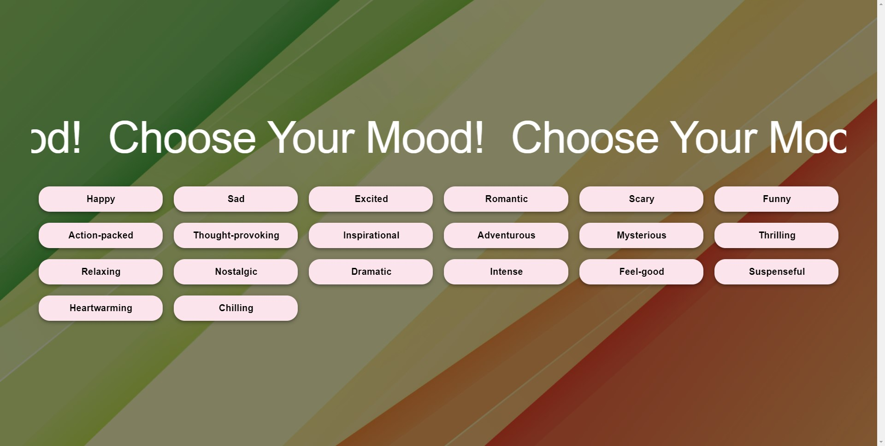
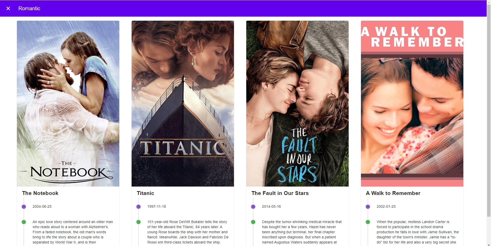

# CineMoodify

A web application for mood-based movie recommendations. 
This project utilizes Vue3 for the frontend and Node.js for the backend. The OpenAI API was used to generate movie recommendations based on user-selected moods. Additionally, the Movie DB API was utilized to retrieve detailed information about the recommended movies.

* Frontend: Vue3, Vuetify
* Backend: Node.js, Express
* API Requests: Axios

## Screenshots

